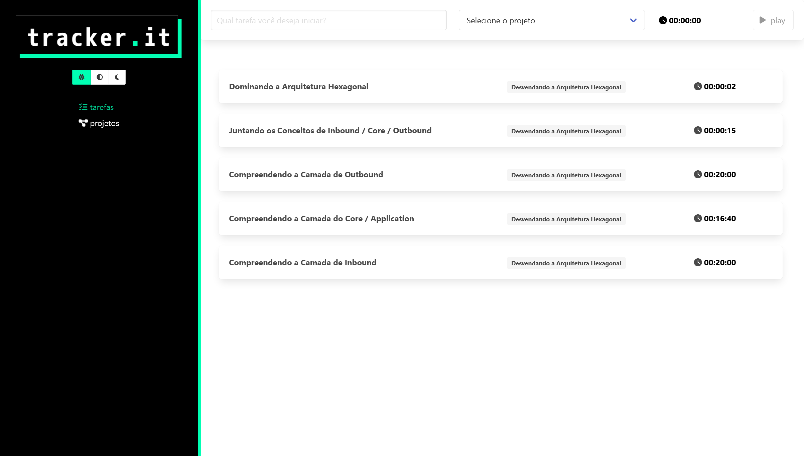

# tracker-it

A simple app to manage your time in custom tasks and projects.



## Project setup
```
npm install
```

### Compiles and hot-reloads for development
```
npm run serve
```

### Compiles and minifies for production
```
npm run build
```

### Lints and fixes files
```
npm run lint
```

### Install JSON Server
```
npm install -g json-server 
```

### Starts JSON Server & Watch db.json
```
json-server --watch db.json 
```

### Customize configuration
See [Configuration Reference](https://cli.vuejs.org/config/).
